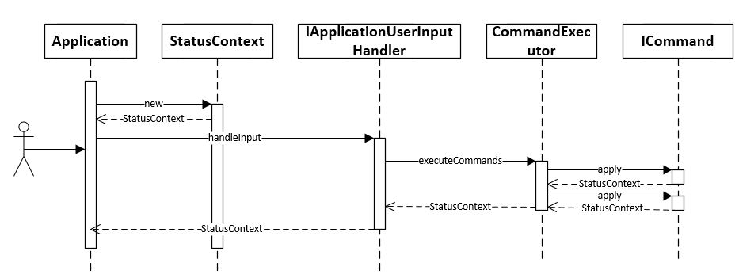

Toy Robot Simulator
===================

Description
-----------

- The application is a simulation of a toy robot moving on a square tabletop,
  of dimensions 5 units x 5 units.
- There are no other obstructions on the table surface.
- The robot is free to roam around the surface of the table, but must be
  prevented from falling to destruction. Any movement that would result in the
  robot falling from the table must be prevented, however further valid
  movement commands must still be allowed.

Create an application that can read in commands of the following (textual) form:

    PLACE X,Y,F
    MOVE
    LEFT
    RIGHT
    REPORT

- PLACE will put the toy robot on the table in position X,Y and facing NORTH,
  SOUTH, EAST or WEST.
- The origin (0,0) can be considered to be the SOUTH WEST most corner.
- The first valid command to the robot is a PLACE command, after that, any
  sequence of commands may be issued, in any order, including another PLACE
  command. The application should discard all commands in the sequence until
  a valid PLACE command has been executed.
- MOVE will move the toy robot one unit forward in the direction it is
  currently facing.
- LEFT and RIGHT will rotate the robot 90 degrees in the specified direction
  without changing the position of the robot.
- REPORT will announce the X,Y and F of the robot. This can be in any form,
  but standard output is sufficient.

- A robot that is not on the table can choose the ignore the MOVE, LEFT, RIGHT
  and REPORT commands.
- Input can be from a file, or from standard input, as the developer chooses.
- Provide test data to exercise the application.
- The application must be a command line application.

Constraints
-----------

- The toy robot must not fall off the table during movement. This also
  includes the initial placement of the toy robot.
- Any move that would cause the robot to fall must be ignored.

Example Input and Output
------------------------

### Example a

    PLACE 0,0,NORTH
    MOVE
    REPORT

Expected output:

    0,1,NORTH

### Example b

    PLACE 0,0,NORTH
    LEFT
    REPORT

Expected output:

    0,0,WEST

### Example c

    PLACE 1,2,EAST
    MOVE
    MOVE
    LEFT
    MOVE
    REPORT

Expected output

    3,3,NORTH

# Implementation

### Overarching design

The application is consisting of two components, user input and command execution

User will be able to provide individual commands like PLACE, LEFT etc through option selection on screen. 
User can alternatively choose to provide file as an input containing list of commands 

##### Overarching design diagram


Each command will be interpreted and converted to a command (Command pattern) which will be executed on the given context. 
A command will change the context based on the set of conditions and return the context back to the user input module to operate on next command

##### Sequence of events


#### Adding a new command 
e.g. JUMP 3

1. Create a class `JumpCommand` implementing `ICommand` and `IParameterized` interface. 
The `IParameterized` interface is optional and should be implemented if a command needs to accept parameters.

```
public class JumpCommand implements ICommand, IParameterized {
    public JumpCommand(){}
    
    private int jumpSteps;
    
    @Override
    public StatusContext apply(StatusContext context) throws CommandException {
            if(context.isPlaced()){
                // if context is ready to accept commands
                //perform command action here and return updated context
            }
            return context;
    }
    
    @Override
    public void accept(String... parameters) throws CommandException {
            // perform parsing of parameters here and save them in local variables
    }
}
``` 
2. Add a new enum 'JUMP' in `CommandEnum`

```
    public enum CommandEnum {
        ..,
        JUMP(JumpCommand.class)
    }
```
Improvement note: The `CommandEnum` class can be made redundant by introducing CDI to annotate all commands with `@Command` annotation
and auto scanning all available commands in the program. This will make addition of new commands easier

#### Changing size of the board
1. Change minimum/maximum X and minimum/maximum Y in class `com.example.robot.commands.data.Constants`

```
    // Minimum x that robot can move to
    public static final int MIN_X_MOVEMENT = 0;

    // Minimum y that robot can move to
    public static final int MIN_Y_MOVEMENT = 0;

    // Maximum x that robot can move to
    public static final int MAX_X_MOVEMENT = 4;

    // Maximum y that robot can move to
    public static final int MAX_Y_MOVEMENT = 4;
```
 
# Test cases

Test case classes:
`com.example.robot.commands.CommandsTest`
`com.example.robot.system.ApplicationFileInputHandlerTest`
`com.example.robot.system.ApplicationConsoleInputHandlerTest`

The `CommandsTest` is parameterized and takes its test parameters from resource file `src/test/resources/command_test.csv`

Sample data in `command_test.csv` file
```$xslt
# "expected message", "new line separated list of commands"
"0,1,NORTH","PLACE 0,0,NORTH
MOVE
REPORT",
```

`ApplicationFileInputHandlerTest` is for testing user file input module
`ApplicationConsoleInputHandlerTest` is for testing user file input module

# Installation

This project is tested to build on Java 8. It uses Maven as its build system, and should run on Maven 3.0 and above.

### Using Maven command goals

To build the project with unit test cases

```
mvn clean verify 
```

# Execution

Run program in user interactive mode
```
java -jar target/toy-robot-simulator.jar 
```

Run program with file input
```
java -jar target/toy-robot-simulator.jar --file src/test/resources/file_input_test1.txt
```

### Docker support

The program can be built into Docker image using following commands

Build docker image
```
docker image build -t toy-robot-simulator:latest .
```

Run docker image
```
docker run -it --rm --name toy-robot toy-robot-simulator
```

Run docker image with parameters

```
docker run -it --rm -v  $(pwd)/src/test/resources/file_input_test1.txt:/commands.txt --name toy-robot toy-robot-simulator --file /commands.txt
```
